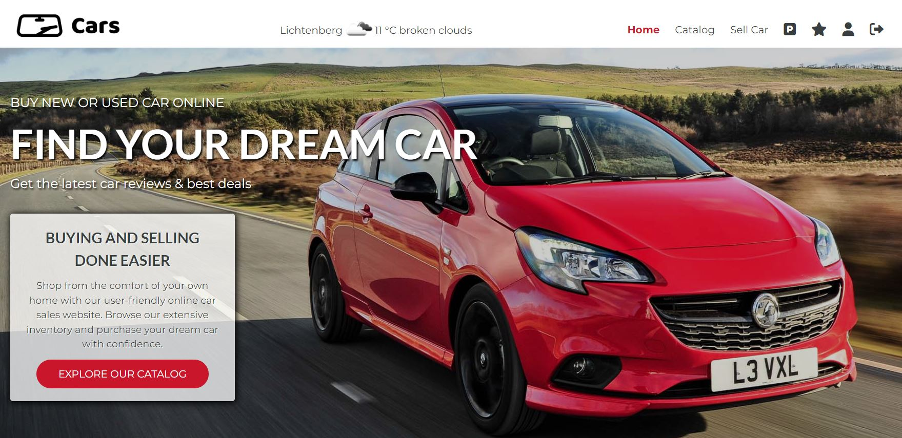
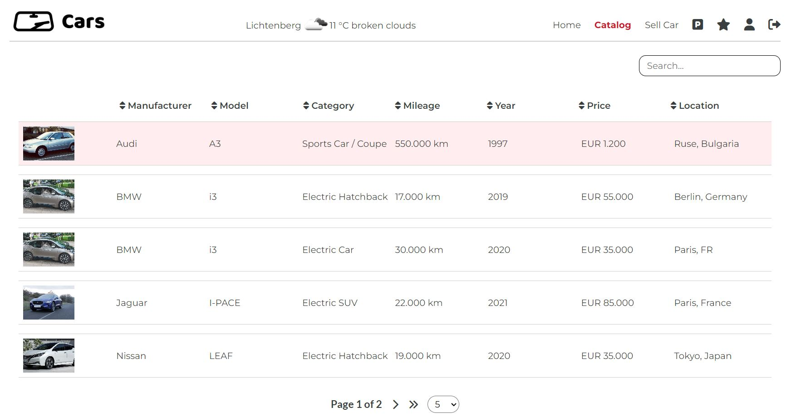
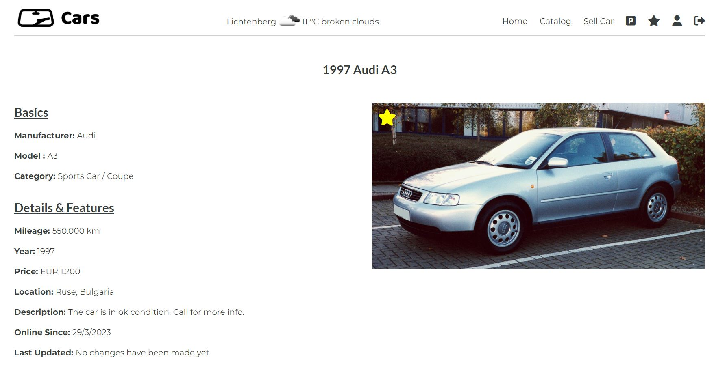
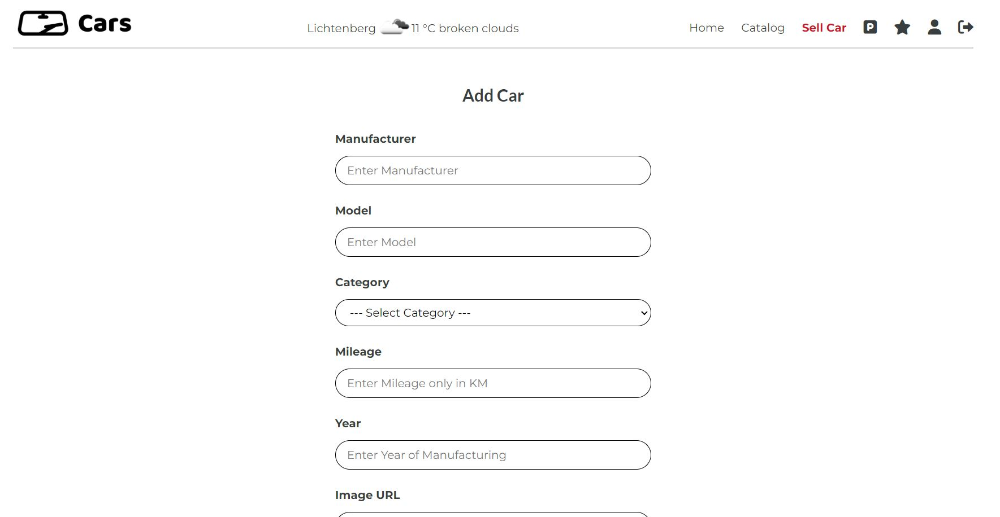
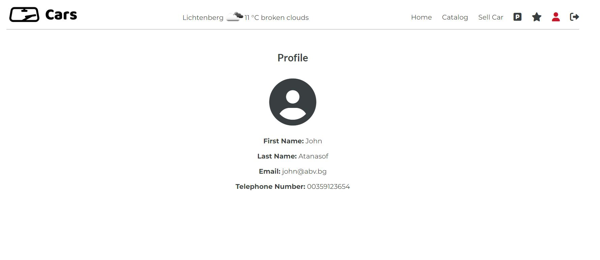
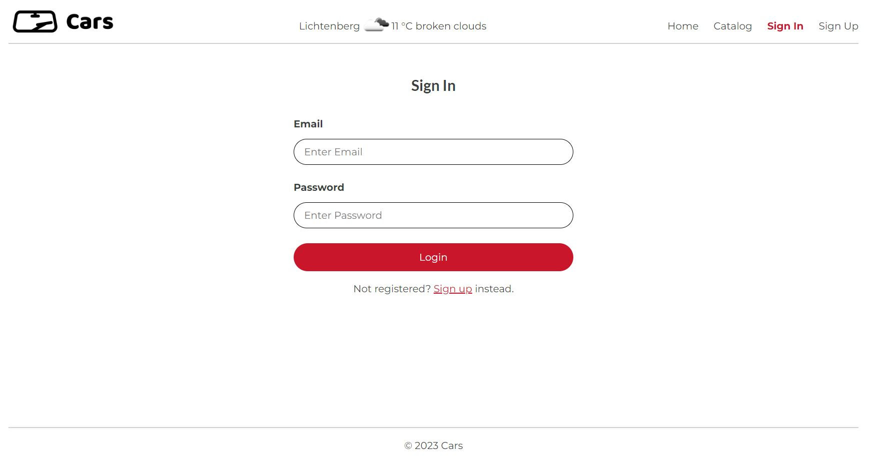
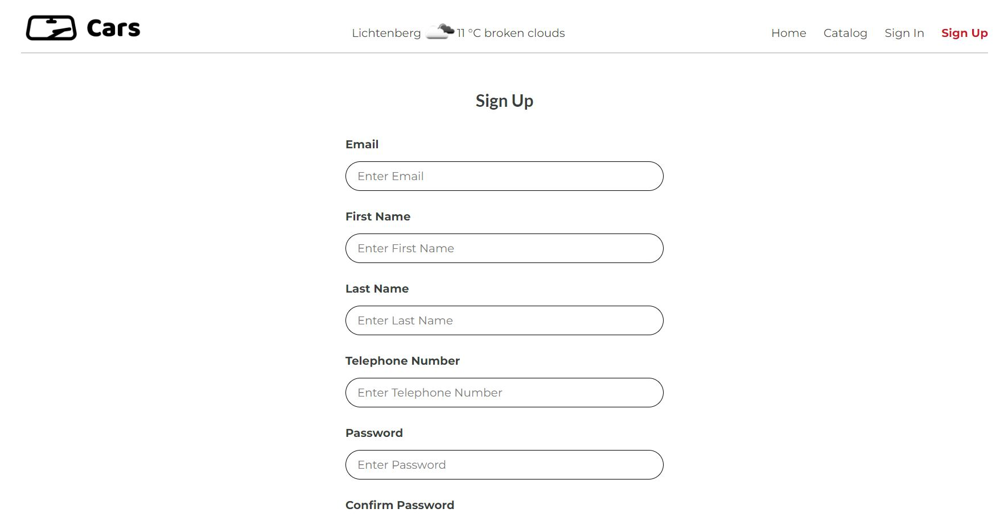

## Cars

A car sales application, built with React, JavaScript, HTML and CSS. As backend server, the one provided by SoftUni (https://github.com/softuni-practice-server/softuni-practice-server) was used.

This project is currently in development. Users can:

-   register
-   login (if registered)
-   upload car (if authenticated)
-   edit car (if authenticated and owner)
-   delete car (if authenticated and owner)
-   add to favourites (if authenticated)
-   remove from favourites (if authenticated)
-   search
-   filter
-   paginate
-   access profile page (if authenticated)

## Project Screen Shots

#### -------------------------------------------------------- Homepage --------------------------------------------------------

#### -------------------------------------------------------- Catalog --------------------------------------------------------

#### -------------------------------------------------------- Car Details --------------------------------------------------------

#### -------------------------------------------------------- Add Car --------------------------------------------------------

#### -------------------------------------------------------- Profile --------------------------------------------------------

#### -------------------------------------------------------- Login --------------------------------------------------------

#### -------------------------------------------------------- Register --------------------------------------------------------

## Installation and Setup Instructions

Clone down this repository. You will need `node` and `npm` installed globally on your machine.

Installation:

`npm install`

To Run Test Suite:

`npm test`

To Start Application:

`npm start`

To Start Server:

`npm start-server`

To Visit App:

`localhost:3000/`

## Project Assignment Requirements

This project is part of the final evaluation for the ReactJS course (second course of the Front End module) at the SoftUni.

### Application Sructure

The application has:

• Public Part (Accessible without authentication) which gives access to landing page, user login, and user registration forms, as well as access to the general car catalog without disclosing user contact data.

• Private Part (Available for Registered Users) which allows registered users to have personal area in the application accessible after successful login. The Private Part expands on the Public part by disclosing the contact data of owners who listed their cars for sale. Additionally, users have dedicated pages for their own cars and favourite cars. Registered users can mark cars as "favourites" and add/edit/delete car details.
